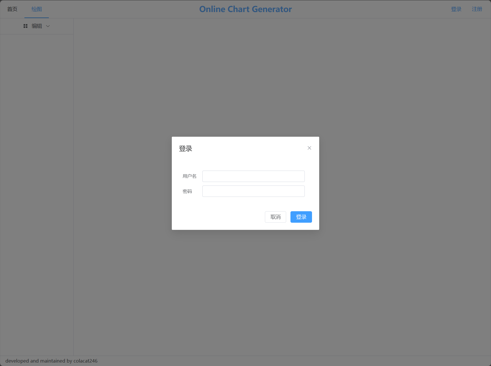
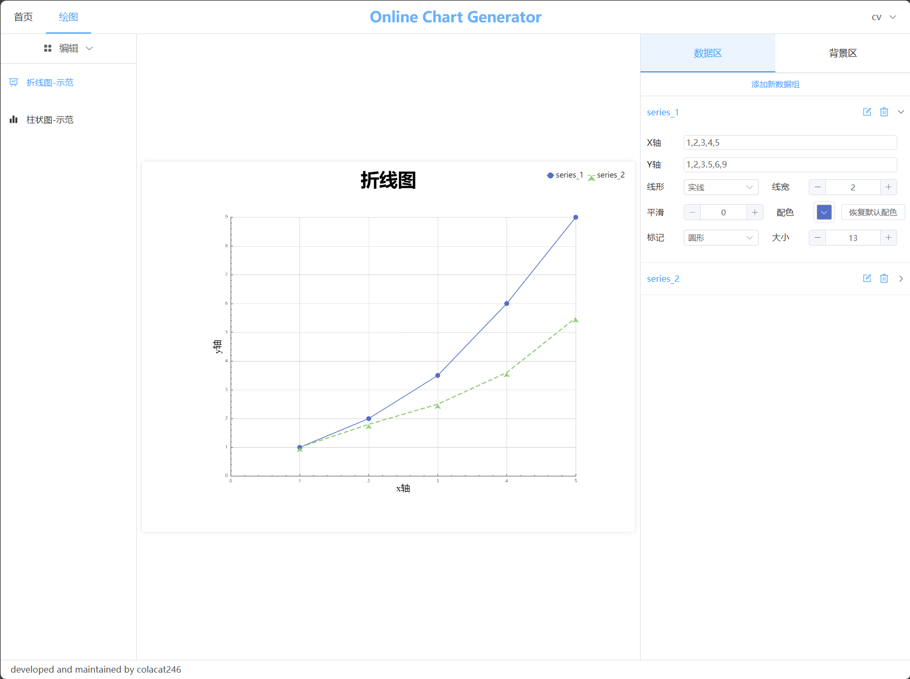

# README

## 版本

v0.1

## 描述

这是一个快速在线编辑图表的工具网站前端模块，用户可通过在线输入数据快速创建图表，并配置样式，并提供数据保存、图像下载功能。目前有折线图、柱状图、饼图三种图表，可根据需要拓展更多图形。

## 功能

* 创建多个图表
* 数据输入
* 多种自定义样式配置
* 保存 / 自动保存数据
* 保存图表至本地
* 基于token的自动登录
* 页面基于屏幕宽度自适应

## 安装

前端：

```sh
git clone https://github.com/colacat246/online_chart_generator_fr.git
# 进入项目路径后
npm run build
npm run preview
```

后端：[见此](https://github.com/colacat246/online_chart_generator_ba)

## 技术栈

* vue3
* echarts
* element-plus
* pinia
* vue-router
* axios
* vite

## 项目效果截图




## 试用

[点击链接玩一玩吧](http://8.134.162.35:7800/)
